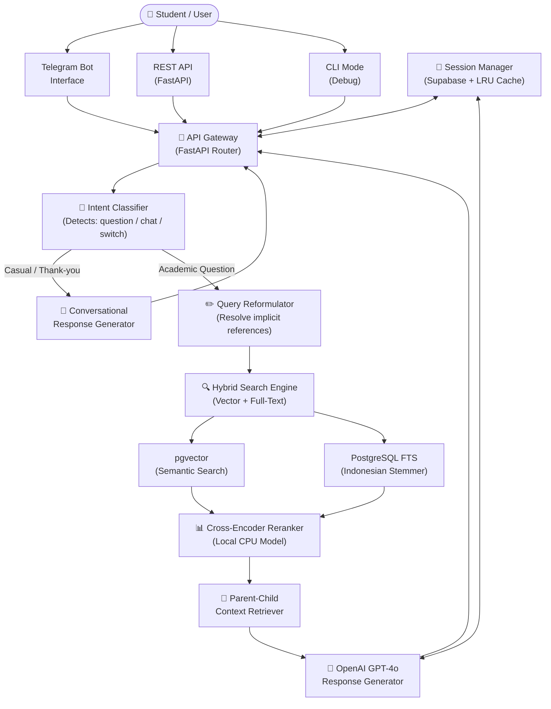
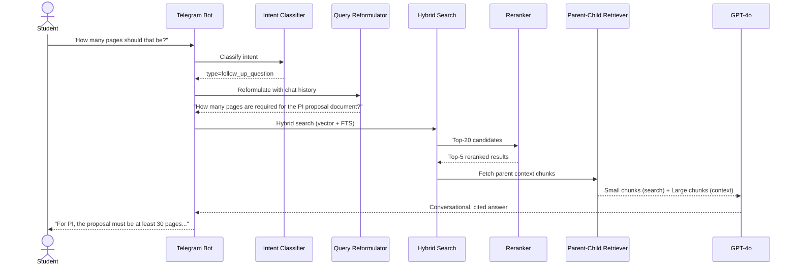
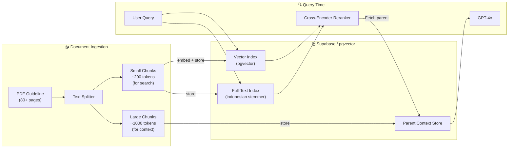
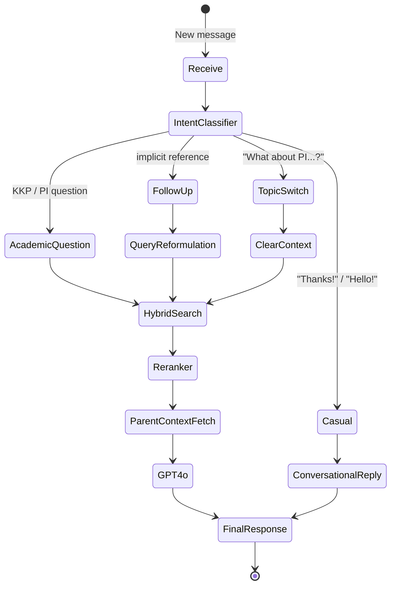
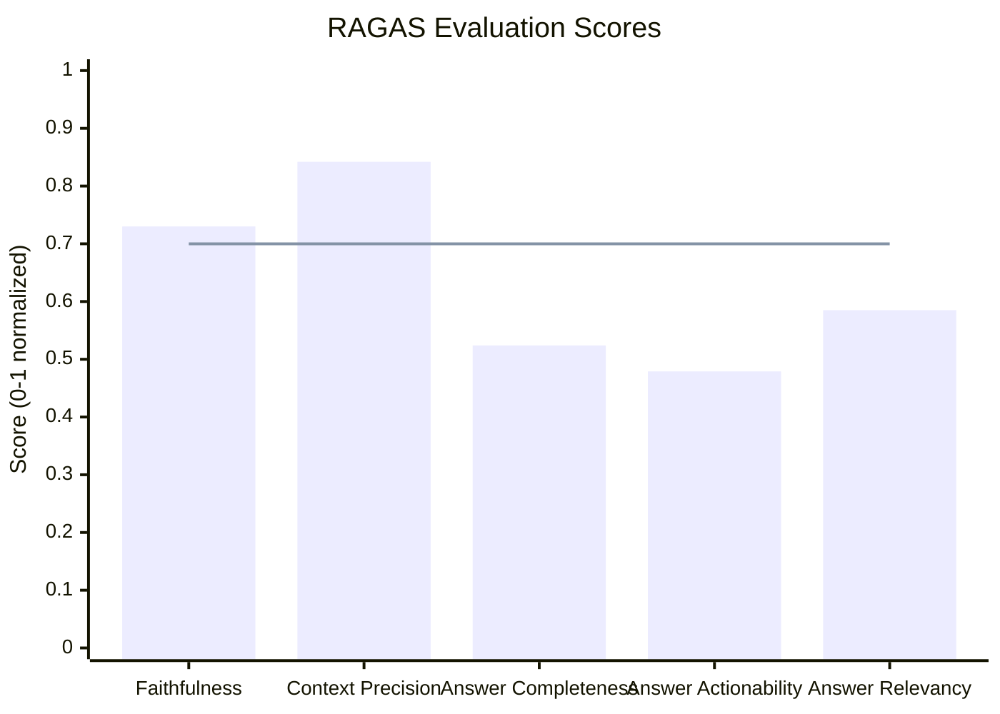
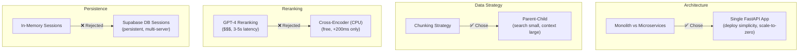

## Project Summary & Role

**Intelligent Academic Assistant** is an AI-powered chatbot system (Retrieval-Augmented Generation) designed to resolve student confusion regarding university academic guidelines.

**My Role:** Solo Developer (*End-to-end development*, from researching the RAG pipeline and designing the backend architecture to integrating the Telegram Bot).

**Try it Live:** [Chat with the bot on Telegram](https://t.me/kkp_pi_assistant_bot)

---

## The Problem That Kept Me Up at Night

Picture this: it's 2 AM, and I'm scrolling through our class WhatsApp group. Again, someone's asking *"What are the KKP requirements?"*—for the third time this week. The same question that was answered in our 80-page guideline PDF, if you knew where to look.

I watched my classmates struggle with this constantly. We had all the information we needed, sitting right there in official university documents. But finding specific answers meant diving into dense, academic text that wasn't exactly designed for quick lookups. Most people just gave up and asked seniors, creating a weird game of telephone where information got distorted along the way.

The department head was getting bombarded with the same questions over and over. Students were stressed. Information was scattered. And I thought: *"There has to be a better way."*

That's when I realized this wasn't just about building a chatbot—it was about understanding how to make knowledge truly accessible. I wanted to build something that didn't just search documents, but actually **understood** what students were asking and could have real conversations about complex academic processes.

---

## System Architecture

The system follows a **Retrieval-Augmented Generation (RAG)** pipeline with multiple intelligent layers—from query understanding to context-aware response generation.

---

## RAG Pipeline Deep Dive

The core of the system is a multi-stage retrieval pipeline that balances **precision** (finding the right chunks) with **context** (giving the AI enough background to answer well).

---

## Document Indexing Strategy

A key architectural decision was the **Parent-Child chunking** approach. Documents are stored *twice*: small chunks for precise search, large chunks for rich context.

---

## The Breakthrough Moments

Building this system taught me that RAG isn't just "search + generate"—it's about understanding the subtle dance between precision and context.

**The "Lost Context" Problem** — Early on, I chunked documents into small pieces for better search accuracy. But the AI would give answers like "You need to submit Form X" without explaining what Form X was for, because that context lived in a different chunk. The solution: *parent-child chunking*—search with small precise chunks, but feed the AI the full parent section for context.

**The Indonesian Language Challenge** — Most RAG tutorials assume English. Indonesian has different stemming patterns. I spent days on custom tokenization before discovering that PostgreSQL's built-in `to_tsvector('indonesian')` with a Snowball stemmer was already better than anything I could write. Sometimes the best solution is the one already there.

**The "Expensive Reranking" Dilemma** — Using GPT-4 to rerank results would cost a fortune and add 3–5 seconds per query. I discovered cross-encoders—local models that evaluate query-document pairs almost as well as GPT-4, running on CPU for free. Game changer.

**The Context Switching Mystery** — When someone asks "What about PI requirements?" after discussing KKP, the system must detect the topic switch. I built an intent classifier that detects these switches with 100% accuracy in testing.

---

## Conversation Flow & Intent Classification

Not every message needs document retrieval. The intent classifier routes each message through the correct path.

---

## Three Ways to Talk to It

| Interface | Purpose | Key Feature |
|-----------|---------|-------------|
| 🤖 **Telegram Bot** | Main user interface | Natural chat—no commands, no learning curve |
| 🌐 **REST API** | Campus system integration | FastAPI with full OpenAPI docs |
| 💻 **CLI Mode** | Developer debugging | Direct pipeline inspection |

**Telegram Bot**: Students chat naturally—it feels like texting a knowledgeable senior who's always available.

**REST API**: Clean, documented FastAPI endpoints that other developers could actually integrate into existing campus systems.

**CLI Mode**: My debugging companion. When something wasn't working, I could test queries directly and see exactly what was happening at each pipeline stage.

---

## Evaluation Results (RAGAS)

I used the RAGAS framework to evaluate the system objectively—no cherry-picking, no manual grading.

| Metric | Score | Status | What This Actually Means |
|--------|-------|--------|-----------------------------|
| Faithfulness | 0.730 | ✅ PASS | No hallucinations—answers stick to source documents |
| Context Precision | 0.842 | ✅ PASS | Retrieval finds the right information |
| Answer Completeness | 5.24/10 | ✅ PASS | Answers cover what users need to know |
| Answer Actionability | 4.79/10 | ✅ PASS | Users can actually act on the information |
| Answer Relevancy | 0.585 | ⚠️ Note | Lower because I chose conversational over concise |

**The Answer Relevancy Story** — This score initially worried me. RAGAS prefers short, dense answers. But I deliberately made the bot more conversational—like a helpful senior, not a search engine. Students prefer *"Here's what you need for KKP, and here's why each requirement matters..."* over a bare bullet list. The metric penalized this design choice, but user feedback validated it.

---

## Key Technical Decisions

| Decision | Choice | Reason |
|----------|--------|--------|
| **Architecture** | Monolith FastAPI | Deployment simplicity; one container scales to zero |
| **Chunking** | Parent-Child | Better answers at the cost of extra storage |
| **Reranking** | Local cross-encoder | Saves hundreds in API costs; only +200ms latency |
| **Sessions** | Supabase DB | Persistent conversations survive server restarts |

---

## What I Learned

**Indonesian Language Quirks** — Spent days building custom tokenization before discovering PostgreSQL's built-in Indonesian stemmer outperformed it. The best solution is often already there.

**Evaluation Integrity** — When expanding acronyms (PI ↔ Penelitian Ilmiah, KKP ↔ Kuliah Kerja Praktek), I had to ensure neutral, bidirectional expansion to avoid biasing retrieval results.

**Graceful Degradation** — Built automatic fallbacks so the system keeps working even when Supabase is down. Database sessions fall back to memory; search falls back to simpler methods. Users never see a broken system.

**Async Everything** — Made all I/O operations non-blocking so the FastAPI server handles multiple Telegram webhooks simultaneously without users waiting for each other.

> This project taught me that production-ready AI isn't just about the model—it's about all the unglamorous infrastructure that makes it reliable when real people depend on it.

---

**Read the full technical deep-dive** → [Blog Post](/blog/chatbot-kkp-pi).
---

## Source Code

The complete source code for this project is available at:

[GitHub Repository](https://github.com/Fauza27/penelitian-ilmiah?utm_source=chatgpt.com)

The repository also includes Architecture Decision Records (ADR) documentation explaining various design decisions and technical trade-offs made during development.