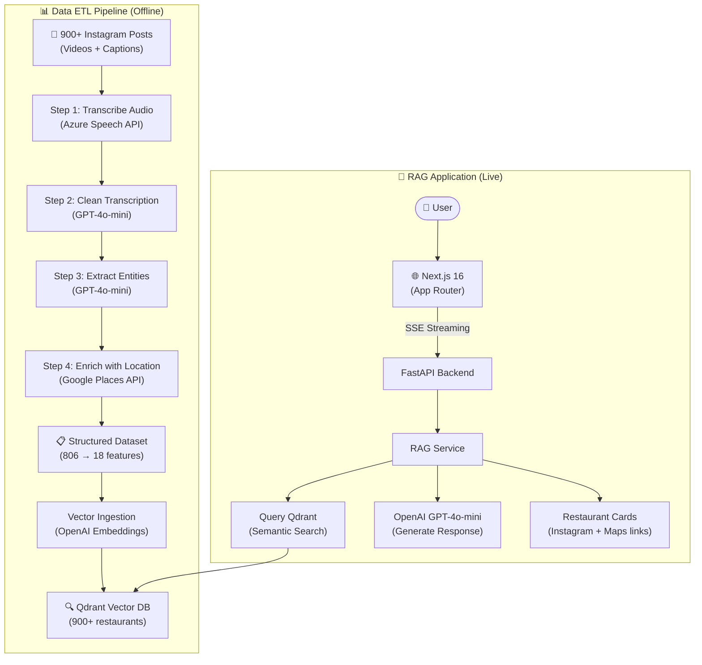
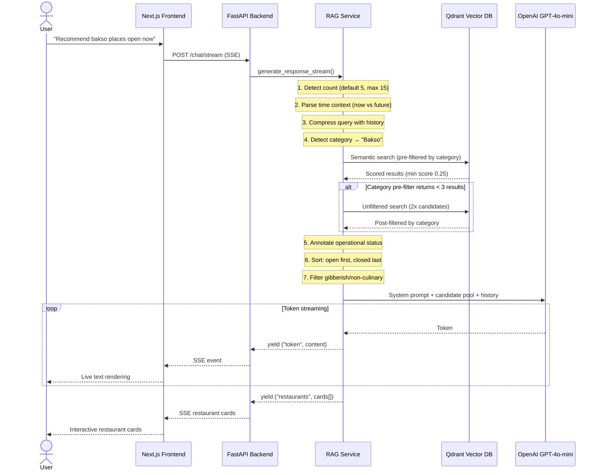

## Project Summary & Role

**Samarinda Food Chatbot** is an AI-powered restaurant recommendation platform that transforms hundreds of Instagram food vlog videos into a searchable, conversational knowledge base. Instead of scrolling through months of old social media posts, users can ask natural questions like *"Recommend 3 affordable soto places open right now"* and get grounded, context-aware recommendations with Instagram links, Google Maps navigation, menus, and real-time operational status.

**My Role:** Solo Developer (*End-to-end development*). Built the complete 4-step ETL data pipeline (video transcription, cleaning, extraction, geolocation), designed the RAG architecture with multi-stage retrieval, developed the FastAPI backend with SSE streaming, and created the Next.js frontend.

---

## Why I Built This

My brother is a food vlogger in Samarinda. Over the years, he has reviewed hundreds of local restaurants on Instagram-sharing detailed information about prices, atmosphere, specific dishes, and operational hours.

But Instagram is built for a timeline, not an archive.

If I suddenly craved a specific type of noodle dish late at night, finding his recommendation meant manually scrolling through months of old posts, watching videos one by one, and hoping I stumbled across the right one. The information existed, but it was **trapped inside a format that was impossible to search.**

I realized this wasn't just a personal inconvenience. It was a data accessibility problem with a clear technical solution: transform unstructured social media content into a structured, searchable knowledge base powered by AI.

---

## System Architecture

The system has two main components: an **ETL data pipeline** that processes Instagram content into structured data, and a **RAG service** that uses that data to answer natural language questions.

---

## The Data Pipeline: From Videos to Knowledge

The most challenging part of this project wasn't the AI chatbot-it was building the **4-step ETL pipeline** that turned raw Instagram content into production-ready structured data.

```mermaid
flowchart LR
    subgraph Step1 ["Step 1: Transcribe"]
        V["🎬 500+ Videos"] --> AZ["Azure Speech API\n(Indonesian)"]
        AZ --> Raw["Raw Transcriptions\n(78% success rate)"]
    end

    subgraph Step2 ["Step 2: Clean"]
        Raw --> GPT1["GPT-4o-mini\n(Fix typos, grammar)"]
        GPT1 --> Clean["Cleaned Text"]
    end

    subgraph Step3 ["Step 3: Extract"]
        Clean --> GPT2["GPT-4o-mini\n(Entity Extraction)"]
        GPT2 --> Struct["Structured JSON\n(name, price, menu, hours)"]
    end

    subgraph Step4 ["Step 4: Enrich"]
        Struct --> GCP["Google Places API\n(Maps links, coordinates)"]
        GCP --> Final["Final Dataset\n(18 features per restaurant)"]
    end
```

### Step 1: Video Transcription

After systematically collecting over 900 Instagram videos from his account, the first processing step was transcription. I used the Azure Speech API with Indonesian language support. Around 700 videos were successfully transcribed. The remaining videos were music-only, ambient, or too noisy.

### Step 2: Transcript Cleaning

Raw transcriptions were messy-full of typos, broken sentences, and misheard words. I used GPT-4o-mini to clean each transcript while preserving the original meaning. This step was critical because bad transcriptions would poison the downstream extraction.

### Step 3: Entity Extraction

The cleaned transcripts were processed by GPT-4o-mini to extract structured entities: restaurant name, food category, price range, menu items, facilities, operational hours, and location. The model parsed expressions like *"harganya dari 15 ribu sampai 25 ribu"* into standardized `"15K - 25K"` format.

### Step 4: Geolocation Enrichment

Extracted locations were enriched with Google Places API to get precise Google Maps links, coordinates, and verified addresses. This allowed the chatbot to provide navigation links alongside recommendations.

### Results

| Metric | Value |
|--------|-------|
| Instagram posts processed | 900+ |
| Videos successfully transcribed | ~700 |
| Restaurants in database | 900+ |
| High-quality profiles | 484 (53.8%) |
| Standardized food categories | 227 |
| Data completeness rate | 97.4% |
| Location extraction success | 70% |
| Hours extraction success | 50% |
| Hashtag extraction success | 94% |

---

## The RAG Engine: Multi-Stage Retrieval

The `RAGService` class (767 lines) is the brain of the application. It implements a sophisticated retrieval pipeline with multiple fallback strategies to ensure the user always gets relevant results.

### Multi-Stage Retrieval Strategy

The retrieval system uses a cascading fallback approach to balance precision and coverage:

1. **Category pre-filter:** If the query mentions "bakso", filter Qdrant results to `kategori_makanan = "Bakso"` first.
2. **Score threshold:** Results below a minimum relevance score of 0.25 are filtered out (calibrated against real query patterns).
3. **Fallback to post-filter:** If pre-filtering returns fewer than 3 results (sparse category), run an unfiltered search with 2x candidates and post-filter by category.
4. **Fallback to unscored:** If no results pass the score threshold, take the top 10 results without score filtering.

This ensures the chatbot **always has something relevant to recommend**, even for rare food categories.

### Gibberish Detection

Not all Instagram videos are restaurant reviews-some are music clips, religious greetings, or random audio. The `_is_gibberish_ringkasan()` method filters these out using:

- Minimum word count threshold (8 words)
- Blacklisted phrases that indicate non-food content
- `is_culinary_content` flag from the ETL pipeline

### Context-Aware Time Intelligence

The system automatically adjusts recommendations based on time context:

| Time Window | Category | Example Query |
|-------------|----------|---------------|
| 06:00 - 10:00 | Breakfast | *"sarapan pagi"* |
| 11:00 - 14:00 | Lunch | *"makan siang"* |
| 15:00 - 17:00 | Snacks/Coffee | *"nongkrong"* |
| 18:00 - 21:00 | Dinner | *"makan malam"* |
| 21:00+ | Late night | *"makan malam minggu"* |

The system also supports **future time parsing**: *"tempat sarapan besok pagi"* or *"restoran yang buka jam 7 malam"* will evaluate operational hours at the specified future time, not the current time.

---

## Conversation History Compression

For multi-turn conversations, the system uses a **query compression** technique. When the user says *"yang lebih murah"* (something cheaper), the RAG needs to understand what "cheaper" refers to.

The `_compress_query_with_history()` method sends the last 4 conversation exchanges to GPT-4o-mini with a prompt asking it to produce a standalone search query. For example:

- **Turn 1:** *"Recommend bakso places"* → LLM recommends 5 places
- **Turn 2:** *"yang lebih murah"* → Compressed to: *"Rekomendasi tempat bakso murah di Samarinda"*

This compressed query is then used for the vector search, ensuring relevant retrieval even in multi-turn conversations.

---

## Restaurant Cards: Actionable, Not Just Text

Each recommendation generates a rich `RestaurantCard` with actionable metadata:

| Field | Source | Purpose |
|-------|--------|---------|
| `nama_tempat` | ETL extraction | Display name (with deduplication) |
| `kategori_makanan` | 227 standardized categories | Filtering and display |
| `range_harga` | Normalized to "XK - YK" | Budget matching |
| `link_instagram` | Original post URL | Source attribution |
| `link_lokasi` | Google Places API | One-tap navigation |
| `jam_buka` / `jam_tutup` | ETL extraction | Real-time open/closed status |
| `menu_andalan` | Top 5 items | Decision-making |
| `fasilitas` | WiFi, parking, etc. | Preference matching |
| `data_quality` | high / medium / basic | Confidence indicator |

The card generation also handles edge cases: CDN URLs are sanitized (Instagram sometimes leaks CDN links instead of post URLs), generic restaurant names get location suffixes for disambiguation, and duplicate names are deduplicated.

---

## SSE Streaming: Perceived Performance

Without streaming, the chatbot would feel "silent" for 3-5 seconds while the LLM generates a full response. I implemented Server-Sent Events (SSE) to stream tokens as they're generated:

1. **Tokens stream first:** Users see text appearing word by word-perceived latency drops from 5 seconds to under 2 seconds.
2. **Restaurant cards arrive after:** Once the LLM finishes generating text, the cards are sent as a single SSE event.
3. **Done signal:** A final `("done", "")` tuple tells the frontend to close the SSE connection.

---

## Key Technical Decisions

| Decision | Choice | Reason |
|----------|--------|--------|
| **Vector DB** | Qdrant Cloud | Managed service with metadata pre-filtering and cosine similarity |
| **LLM** | GPT-4o-mini | Best cost/quality ratio for Indonesian language understanding |
| **Embedding** | text-embedding-3-large (1536 dim) | High-quality semantic representation |
| **Retrieval** | Multi-stage with fallbacks | Guarantees results even for sparse categories |
| **Streaming** | SSE via FastAPI | Real-time token delivery without WebSocket overhead |
| **Data Pipeline** | 4-step modular Python scripts | Each step can be run independently (`--step 3`) or skipped (`--skip 1,2`) |
| **Rate Limiting** | 10/min chat, 30/min browse | Prevents API cost runaway |
| **SSL Handling** | Automatic fallback | Gracefully handles corporate proxy SSL issues |

---

## What I Learned

**Data Engineering Is the Hard Part** - Building the chatbot UI took days. Building the ETL pipeline that turned over 900 messy Instagram posts into clean, structured restaurant profiles with standardized categories took weeks. In AI systems, the model is rarely the bottleneck-the data quality is.

**Innovation Through Accessibility** - This project completely changed how I view innovation. I didn't create any new data. I took existing content that was trapped in an unsearchable format (Instagram timeline) and made it accessible through natural language. Sometimes the most valuable thing you can do is make existing information easier to find.

**Multi-Stage Retrieval is Essential** - A single vector search query often returns suboptimal results for specific food categories. The cascading approach (pre-filter → post-filter → fallback) was crucial for production reliability.

**Streaming Changes Perception** - The same 5-second response feels instant when streamed token by token. SSE implementation was straightforward but dramatically improved the user experience.

> The biggest lesson from this project: the real engineering challenge in AI isn't the model-it's the pipeline that turns messy, real-world data into clean, structured knowledge that the model can actually use.

---

**Read the full story behind this project** → [Blog Post](/blog/food-recommendation-chatbot).

---

## Source Code & Live Demo

- **GitHub Repository:** [food-recommendation-chatbot](https://github.com/Fauza27/food-recommendation-chatbot)
- **Live Demo:** [food-recomendation-chatbot.vercel.app](https://food-recomendation-chatbot.vercel.app)
- **Demo Video:** [YouTube](https://youtu.be/Dv-y_jWFmbA)

The repository includes the complete FastAPI backend, Next.js frontend, 4-step ETL pipeline, and comprehensive documentation covering architecture, API reference, deployment, and troubleshooting.
