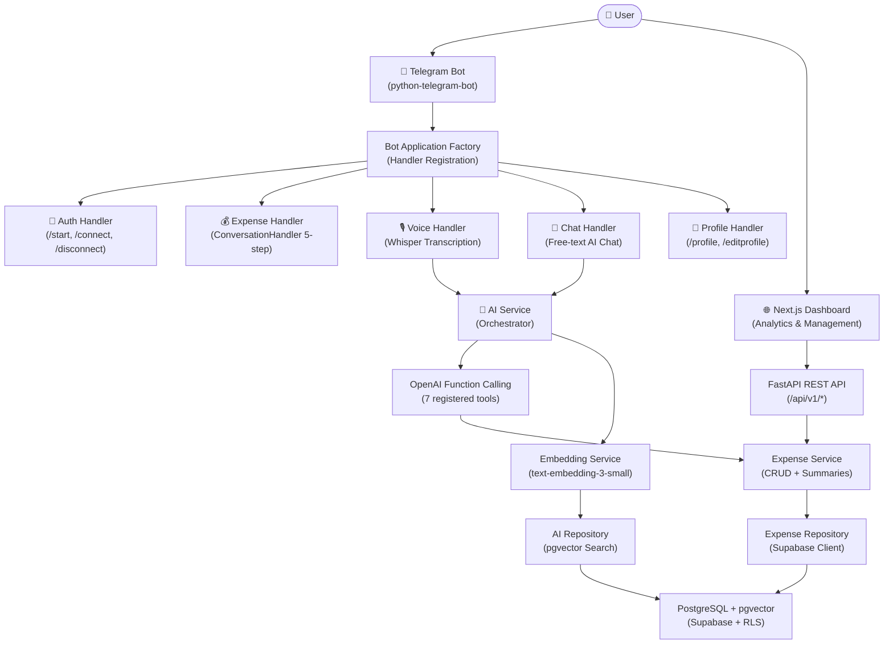
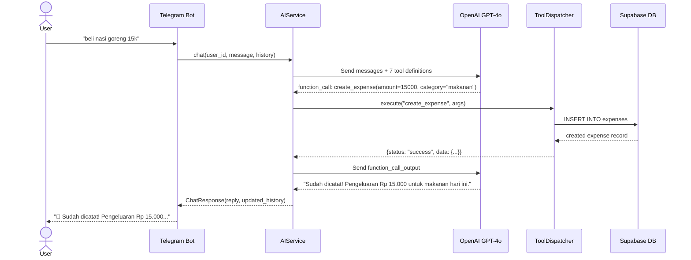
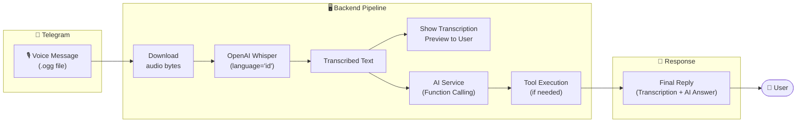
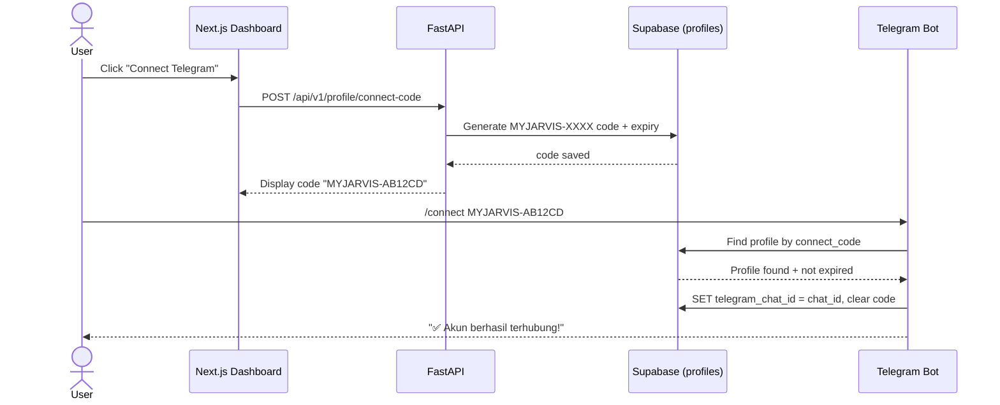
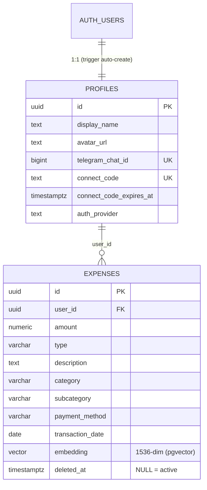
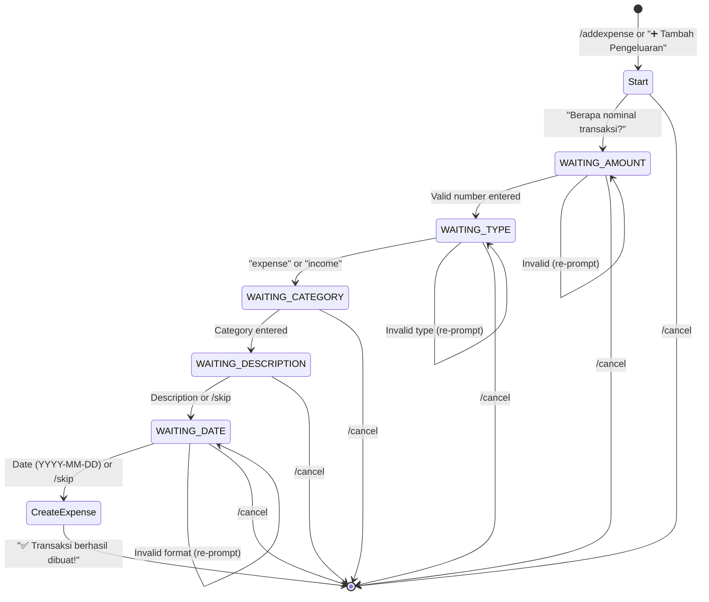
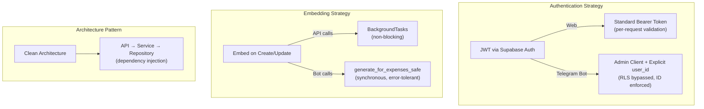

## Project Summary & Role

**My-Jarvis-Gua** is an ongoing, production-grade AI personal assistant inspired by Tony Stark's JARVIS. Instead of using dozens of separate apps, users interact with a single AI system through natural conversations on Telegram—typing messages, sending voice notes, or using structured commands—to manage personal finance, track health, and organize daily life.

**My Role:** Solo Developer (*End-to-end development*). Designed the clean architecture backend in FastAPI, built the AI orchestration layer with OpenAI function calling, implemented Whisper-based voice transcription, integrated Supabase with Row Level Security, and developed the Next.js analytics dashboard.

---

## Why I Built This

One of the main reasons I chose to study Computer Science was because of Tony Stark from Iron Man. I was fascinated by JARVIS—an AI that doesn't just answer questions, but actively manages life's complexities.

In 2026, I found myself with several months to focus entirely on learning and building. Instead of treating it as free time, I challenged myself with an ambitious goal: **build my own personal AI assistant** while significantly improving my AI engineering and system design skills.

To make the project meaningful, I started with problems I personally faced every day. My digital life was fragmented across a dozen different apps:

* expenses tracked in one budgeting app,
* vehicle maintenance dates scattered in spreadsheets,
* health logs isolated on a smartwatch,
* tasks split between sticky notes and to-do apps.

I wanted to explore whether a single AI-powered system could unify these activities, eliminate manual data entry, and provide a complete view of my life through natural conversation.

---

## System Architecture

The core design challenge was enabling a single Telegram bot to handle vastly different intents—from recording a quick coffee expense to generating a full monthly financial summary—while keeping the codebase maintainable and extensible.

I designed a **Clean Architecture** backend with clear separation between API layer, service layer, and repository layer, orchestrated through OpenAI's function calling mechanism.

---

## The AI Brain: Function Calling Deep Dive

The heart of the system is the `AIService` class—an orchestrator that manages conversations with OpenAI's Responses API and automatically executes database operations through **7 registered function tools**.

### The Chat Loop Architecture

The `_run_chat_loop` method implements a multi-turn function calling loop with a safety limit of 10 iterations. This allows the AI to chain multiple tool calls in a single conversation turn—for example, first listing expenses to find a transaction ID, then deleting it.

What makes this different from a simple "send message, get response" pattern:

* **Iterative tool execution:** The loop continues until the model returns plain text (no more tool calls), allowing complex multi-step operations.
* **Conversation history management:** Each turn appends both the user message and assistant reply to a bounded history (last 12 messages), maintaining context across sessions.
* **Strict mode schemas:** All 7 tools use `"strict": true` with explicit JSON schemas, eliminating hallucinated parameters.

### The 7 Registered Tools

| Tool | Purpose | Key Detail |
|------|---------|------------|
| `create_expense` | Record new transaction | Auto-defaults to today's date if not specified |
| `list_expenses` | View transaction history | Supports 9 filter parameters (type, category, date range, search, pagination, sorting) |
| `update_expense` | Modify existing transaction | Partial update—only non-null fields are changed |
| `delete_expense` | Soft-delete a transaction | Uses soft delete (sets `deleted_at` timestamp) |
| `get_monthly_summary` | Monthly income/expense breakdown | Aggregated by month and year |
| `get_yearly_summary` | Annual financial overview | Full-year aggregation |
| `get_all_time_summary` | Lifetime financial stats | Total income, expense, and net balance |

---

## Voice-First Interaction: The Whisper Pipeline

One of the most exciting features is voice message support. Instead of typing, users can simply record a voice note on Telegram, and the system handles everything automatically.

The voice pipeline works in stages:

1. **Download:** The bot downloads the `.ogg` voice file from Telegram's servers.
2. **Transcription:** Audio bytes are sent to OpenAI Whisper with `language="id"` for optimized Indonesian recognition.
3. **Preview:** The transcribed text is immediately shown to the user while the AI processes the intent.
4. **AI Processing:** The transcribed text is enhanced with a prefix `[Pesan suara dari user, sudah ditranskripsi]` and fed into the same AI chat pipeline, including function calling.
5. **Response:** The final message shows both the transcription and the AI's response.

The `transcribe_safe()` method ensures that transcription failures never crash the bot—it returns a tuple of `(text, error)` so the handler can gracefully inform the user.

---

## Secure Account Linking: Web ↔ Telegram Bridge

A critical design challenge was connecting Telegram accounts to web app accounts securely. I implemented a **one-time code verification** system.

Key security decisions:

* **One-time codes** with expiration timestamps prevent replay attacks.
* **Code format** (`MYJARVIS-XXXX`) is designed to be easily distinguishable—the bot also accepts raw code paste via a Regex filter `^MYJARVIS-[A-Z0-9]+$`.
* **Row Level Security (RLS)** on Supabase ensures that even if the bot uses an admin client (required because Telegram webhooks have no JWT context), all queries explicitly enforce `user_id` filtering.

---

## Database Design: Soft Deletes & Vector Search

The PostgreSQL schema combines traditional relational data with vector embeddings for semantic search capabilities.

### Design Decisions in the Schema

**Soft Deletes with Views:** Instead of permanently deleting data, expenses set a `deleted_at` timestamp. An `active_expenses` view automatically filters deleted records, so application queries stay clean while maintaining audit capability with a dedicated `restore_expense()` function.

**Vector Embeddings on Expenses:** Every expense record gets an embedding vector (1536 dimensions from `text-embedding-3-small`). This enables semantic search—when a user asks *"how much did I spend on food last week?"*, the system uses `match_expense()` with cosine similarity to find relevant transactions, even if the exact words don't match.

**HNSW Index:** The vector column uses a Hierarchical Navigable Small World index for fast approximate nearest neighbor search at scale.

**Auto-Profile Creation:** A PostgreSQL trigger (`handle_new_user()`) automatically creates a profile row whenever a new user registers via Supabase Auth, with smart COALESCE logic to extract display names from email, Google OAuth, or GitHub OAuth metadata.

---

## Three Ways to Interact

| Interface | Purpose | Key Feature |
|-----------|---------|-------------|
| 🤖 **Telegram Bot** | Primary interface | Natural language chat, voice notes, inline keyboards, conversation flows |
| 🌐 **Next.js Dashboard** | Visual analytics | Expense charts, budget tracking, transaction management |
| 🔌 **REST API** | Integration layer | Full CRUD with Supabase Auth, OpenAPI documentation |

**Telegram Bot:** The main interface. Users can interact through:
* **Natural chat:** Just type *"beli kopi 25k"* and the AI handles everything.
* **Voice notes:** Record a voice message and Whisper transcribes + AI processes it.
* **Structured commands:** `/addexpense` triggers a guided 5-step ConversationHandler (amount → type → category → description → date).
* **Menu buttons:** Quick-access keyboard buttons for common actions.

**Next.js Dashboard:** A clean, responsive web interface built with shadcn/ui components, TanStack Query for data fetching, and Zustand for state management. Features include expense tables, financial summaries, and a full chat widget.

**REST API:** FastAPI endpoints with Supabase Auth integration, supporting JWT authentication, CORS, and full OpenAPI documentation for potential third-party integrations.

---

## The Structured Expense Flow

Not everything needs AI. For users who prefer guided input, I built a 5-step `ConversationHandler` using python-telegram-bot's state machine.

A critical implementation detail: `ConversationHandler` must be registered **before** the general `MessageHandler` in the bot's handler chain. Otherwise, the fallback text handler would "steal" user input that was meant for the active conversation state.

---

## Key Technical Decisions

| Decision | Choice | Reason |
|----------|--------|--------|
| **AI Integration** | OpenAI Function Calling | Structured tool use with strict JSON schemas—no prompt hacking needed |
| **Voice Processing** | Whisper API (`language="id"`) | Native Indonesian support, reliable transcription quality |
| **Embedding Strategy** | Background generation | Non-blocking: embeddings are generated after expense creation without slowing down the response |
| **Soft Deletes** | `deleted_at` + views | Data auditability with clean application queries |
| **Bot ↔ Web Auth** | One-time code linking | Secure bridge between JWT-based web auth and Telegram's chat ID model |
| **Handler Order** | ConversationHandler first | Prevents general text handler from intercepting multi-step flows |

---

## What I Learned

**The "God Prompt" Trap** — My first attempt used a single massive system prompt trying to handle everything. It hallucinated, forgot context, and became unmaintainable. Switching to OpenAI function calling with strict schemas made the system dramatically more reliable—the AI now knows exactly what tools are available and what parameters they accept.

**Clean Architecture Pays Off** — Separating concerns into API → Service → Repository layers made it trivial to share business logic between the REST API and the Telegram bot. The same `ExpenseService` serves both interfaces without code duplication.

**Voice Changes Everything** — Adding Whisper transcription transformed the user experience. Recording a 5-second voice note saying *"beli makan siang 35 ribu"* is far more natural than typing it out. The key insight: wrapping the transcription in a `transcribe_safe()` method prevents the entire pipeline from crashing on bad audio.

**Security Is Architecture** — The Telegram bot has no JWT context, so it must use the admin client. This means RLS is bypassed, making explicit `user_id` filtering in every single query absolutely critical. I added an `assert user_id` check as the first line of `_make_ai_service()` to prevent cross-user data leakage.

> This project taught me that building a personal AI assistant isn't about making the smartest AI—it's about designing a system where AI, backend engineering, security, and user experience all work together seamlessly.

---

**Read the full story behind this project** → [Blog Post](/blog/my-jarvis-gua).

---

## Source Code

The complete source code for this project is available at:

[GitHub Repository](https://github.com/Fauza27/My-Jarvis-Gua)

The repository includes the full FastAPI backend, Telegram bot implementation, Next.js frontend, database schema, and comprehensive documentation covering authentication flows, feature guides, and deployment instructions.
