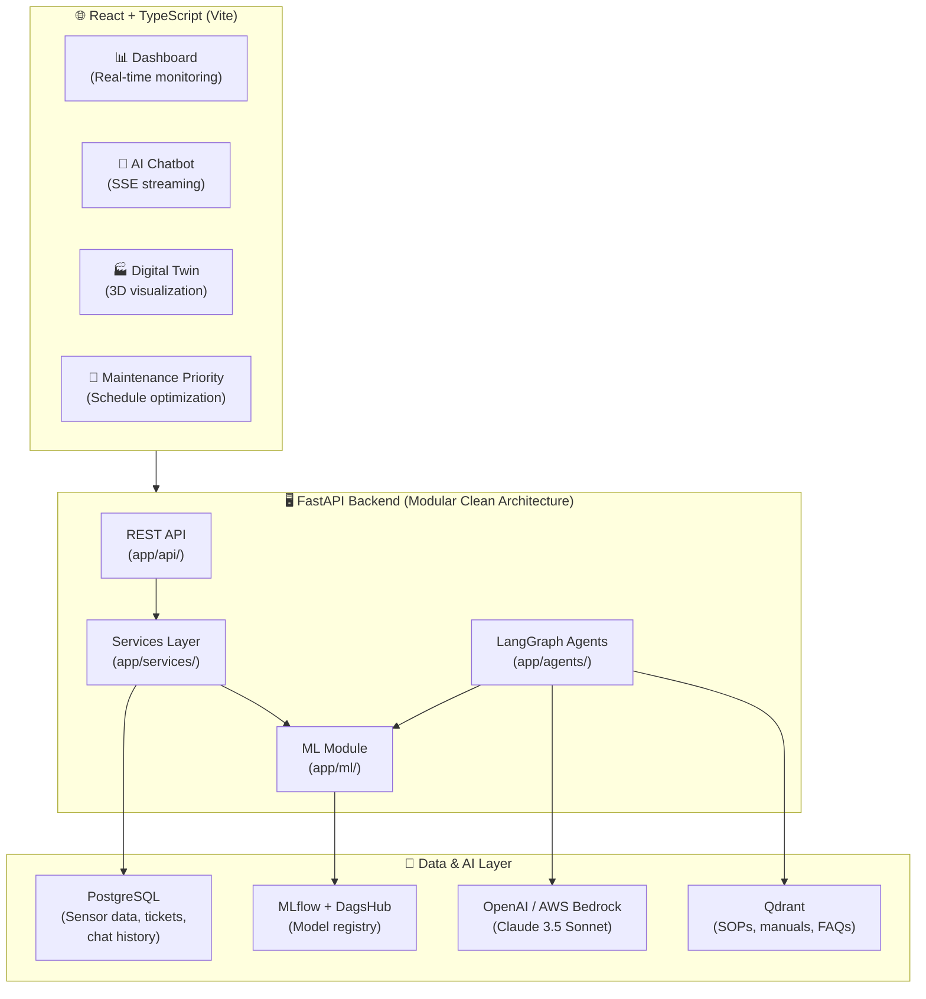
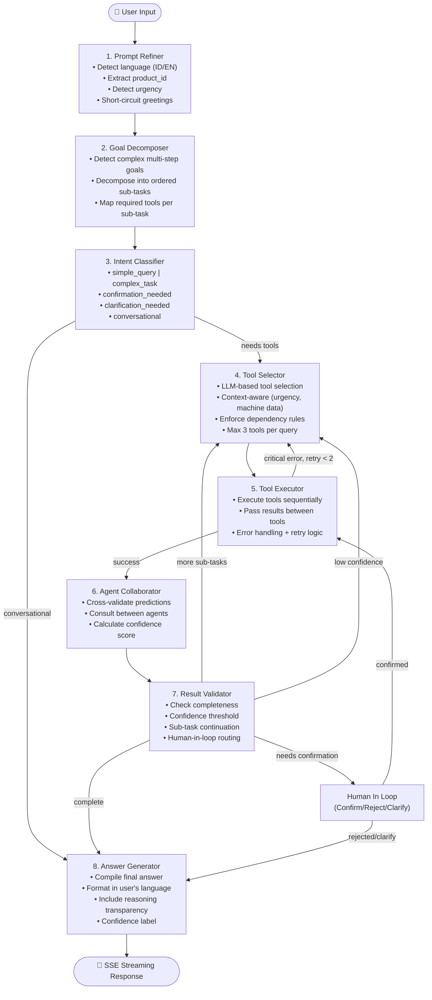
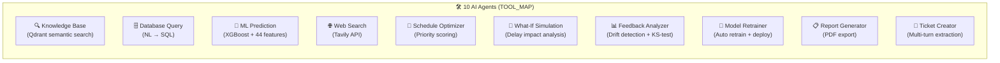
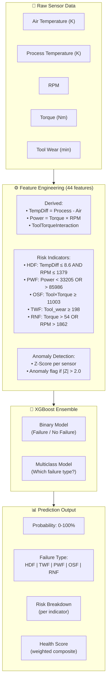

## Project Summary & Role

**Sentinel** is a full-stack predictive maintenance platform that helps industrial O&M teams move from reactive to proactive decision-making. It combines machine learning failure prediction (95.45% recall), 10 specialized AI agents orchestrated by LangGraph, What-If delay simulation, and a real-time monitoring dashboard into a single integrated experience.

**My Role:** Team Lead, Product Manager, AI Engineer (*Group project - Team of 5*). Designed the system architecture, developed the multi-agent AI system and ML pipeline, built the FastAPI backend, and coordinated integration between AI, backend, and frontend components.

---

## Why We Built This

During our capstone project (Dicoding × Accenture ASAH Program), our team explored how AI could help industries move from reactive maintenance to proactive decision-making.

Unexpected equipment failures in manufacturing are costly. A single unplanned downtime event can cost $260K per hour in lost production, create safety risks for workers, and trigger cascade failures across interconnected systems. Traditional maintenance approaches-either fixing things after they break (reactive) or replacing parts on a fixed schedule (preventive)-are both inefficient.

We wanted to investigate whether machine learning and AI agents could give maintenance teams a fundamentally better tool: one that predicts failures before they happen, explains why they're predicted, and helps engineers take the right action at the right time.

---

## System Architecture

The platform has three layers: a React dashboard for visualization, a modular FastAPI backend for API and business logic, and a multi-agent AI system for intelligent decision-making.



---

## The 8-Node LangGraph Pipeline

The AI chatbot is powered by a LangGraph state machine with 8 sequential nodes and conditional routing. Each node is a pure function that takes state in and returns state out.



### The AgentState: Shared Memory

All 8 nodes share a single `AgentState` TypedDict with 30+ fields, including:

- **Conversation context:** messages, thread_id, user auth
- **Language support:** detected_language (ID/EN), language templates
- **Intent & complexity:** intent classification, sub-task decomposition, current sub-task index
- **Tool execution:** selected_tools, tool_results, previous results summary
- **Reasoning transparency:** reasoning_steps (shown to user as "thinking process")
- **Confidence & self-correction:** confidence_score, uncertainty_reasons, retry_count
- **Human-in-loop:** user_confirmed, confirmation_attempts (max 3 to prevent infinite loops)

---

## The 10 Specialized AI Agents

Each agent is a tool that can be selected and executed by the LangGraph pipeline. The `TOOL_MAP` centralizes all tool registrations.



| Agent | Tool Name | Key Capability |
|-------|-----------|----------------|
| **A** | `qdrant_search` | Semantic search on SOPs, manuals, FAQs stored in Qdrant vector DB |
| **B** | `database_query` | Natural language → SQL with temporal context parsing ("last 7 days", "this week") |
| **C** | `predictive_maintenance_api` | XGBoost prediction with 44 engineered features, probability, failure type, risk breakdown |
| **D** | `web_search` | Real-time industry information via Tavily API |
| **E** | `optimization_engine` | Priority-based maintenance scheduling with budget constraints and technician availability |
| **F** | `simulation_engine` | What-If analysis: "What happens if we delay maintenance by 3 days?" with cost projections |
| **G** | `feedback_loop_analyzer` | Model performance monitoring, data drift detection (KS-test), threshold optimization |
| **H** | `intelligent_model_retrainer` | Automated retraining pipeline (SMOTE + XGBoost), comparison with previous model, auto-deploy to MLflow |
| **I** | `report_generator` | Daily/weekly/monthly reports with executive summary, failure breakdown, PDF export |
| **J** | `maintenance_ticket_creator` | Multi-turn conversation for ticket creation with LLM-based information extraction |

### Agent Collaboration Protocol

When the ML Prediction agent returns a failure probability above 50%, the Agent Collaborator node automatically consults the Feedback Analyzer to cross-validate: *"Is this prediction reliable given current model performance?"*

Similarly, when the Schedule Optimizer produces an optimized schedule, it can consult the Simulation Engine to validate: *"Should this schedule be simulated first?"*

This inter-agent consultation happens automatically through `_COLLABORATION_RULES` defined in `graph.py`.

---

## The ML Pipeline: 44 Features, 95.45% Recall

The XGBoost model detects 5 types of equipment failure using 44 engineered features derived from raw sensor data.



### Why 95.45% Recall Matters

In predictive maintenance, the cost asymmetry is extreme:

* **False positive** (predicting failure that doesn't happen): Unnecessary inspection. Cost: $500-2,000.
* **False negative** (missing a real failure): Unplanned downtime. Cost: $260,000/hour.

We deliberately optimized for **recall** (catching real failures) over precision, using a tuned threshold of 0.3108 instead of the default 0.5.

| Metric | Value |
|--------|-------|
| **Recall** | 95.45% |
| **ROC-AUC** | 99.01% |
| Precision | 42.57% |
| Threshold | 0.3108 (tuned) |
| Features | 44 engineered |
| Algorithm | XGBoost Ensemble |

### Automated Retraining Triggers

The Intelligent Model Retrainer (`retrainer.py`, 42,943 bytes) automatically triggers retraining when:

- Recall drops below 90%
- ROC-AUC drops more than 0.5%
- Data drift is detected via KS-test
- Manual trigger via chatbot command

The retraining pipeline includes data preparation, feature engineering, SMOTE for class imbalance, binary + multiclass model training, performance comparison against the previous model, and deployment to MLflow via DagsHub.

---

## The Refactoring Story: From Monolith to Clean Architecture

The original codebase was a monolith: a single `main.py` file with 10,000+ lines containing all 10 AI agents, and a `backend.py` with 2,000+ lines handling REST API, database, and authentication.

This caused real engineering problems:

* **Event loop conflicts:** The AI agents and REST API fought over asyncio event loops.
* **Testing nightmare:** Changing one agent could break unrelated endpoints.
* **Scaling risk:** A single file import loaded the entire AI system into memory for every API request.

I led the refactoring into a **Clean Modular Architecture** (`back-end-refactor/`):

```
app/
├── api/          # REST endpoints (auth, dashboard, machines, tickets)
├── services/     # Business logic (shared between API and agents)
├── schemas/      # Pydantic V2 validation
├── db/           # SQLAlchemy ORM models
├── ml/           # Predictor + Retrainer modules
├── agents/       # LangGraph graph, state, tools, helpers
└── core/         # Configuration, constants, LLM client
```

Key improvements:

* **Separation of concerns:** API routes, business logic, and AI agents live in separate modules.
* **Single entry point:** `main.py` on port 8888 unifies everything-no more dual-server confusion.
* **Security fix:** The database agent now uses a read-only PostgreSQL account to prevent SQL injection through LLM-generated queries.
* **Type safety:** Pydantic V2 strict validation on all request/response schemas.

---

## Dependency-Aware Tool Execution

A subtle but critical design decision: some tools must always run after others.

If a user asks *"Predict failure for machine M12345"*, the ML Prediction agent needs the machine's current sensor data first. The Tool Selector enforces dependency rules:

```
predictive_maintenance_api → always requires database_query first
simulation_engine         → always requires database_query first
```

If the LLM selects `predictive_maintenance_api` without `database_query`, the system automatically inserts it. After `database_query` succeeds, its results populate `state["machine_data"]`, which the ML Prediction agent then uses for feature engineering and prediction.

---

## Reasoning Transparency: Building Trust

Industrial maintenance engineers won't trust an AI that just says *"Machine M12345 will fail."* They need to understand **why**.

Every node in the LangGraph pipeline appends to `state["reasoning_steps"]`-a list of timestamped entries showing:

- What the system detected (language, intent, urgency)
- Which tools were selected and why
- Which agents were consulted
- What the confidence level is at each stage

These reasoning steps are streamed to the frontend alongside the response, allowing engineers to see the AI's "thinking process." This transparency was essential for user trust in a safety-critical domain.

---

## Key Technical Decisions

| Decision | Choice | Reason |
|----------|--------|--------|
| **Agent Orchestration** | LangGraph state machine | Conditional routing, retry logic, and human-in-loop support that simple chains can't provide |
| **ML Model** | XGBoost (not deep learning) | Interpretable, fast inference, works well with 44 engineered features on tabular data |
| **LLM Provider** | OpenAI / AWS Bedrock (Claude 3.5 Sonnet) | Reliable, supports structured output for intent classification and tool selection |
| **Vector DB** | Qdrant | Semantic search on SOPs and maintenance manuals |
| **Model Registry** | MLflow + DagsHub | Version control for models with automated deployment |
| **Database Agent** | Read-only PostgreSQL account | Prevents SQL injection through LLM-generated queries |
| **Threshold** | 0.3108 (tuned) | Optimized for recall in high-cost-of-failure domain |
| **Max Tools** | 3 per query | Balances capability with response latency |

---

## What I Learned

**Multi-Agent Systems Need Guardrails** - Without limits, the LangGraph pipeline could loop infinitely: tool selector → executor → validator → tool selector → ... I added `MAX_SUB_TASK_ITERATIONS`, `MAX_CONFIRMATION_ATTEMPTS`, and a recursion limit to prevent runaway execution. Guardrails aren't just nice-to-have-they're essential for production multi-agent systems.

**Recall Matters More Than Accuracy** - In predictive maintenance, a 95% accurate model that misses 20% of real failures is worse than one with lower accuracy but 95.45% recall. The cost asymmetry ($500 false positive vs $260K/hour false negative) makes the optimization target obvious once you understand the domain.

**Clean Architecture Enables Team Velocity** - The monolithic `main.py` (10,000+ lines) was a bottleneck. After refactoring into modular packages, team members could work on different agents simultaneously without merge conflicts. Architecture is a team productivity multiplier.

**The Refactoring Was Worth It** - Moving from a monolith to clean architecture was time-consuming, but it solved the event loop conflicts, made testing possible, and secured the database agent against SQL injection. In a team project with different skill levels, clear module boundaries are essential.

> This project taught me that impactful software is not defined by complexity, but by how effectively it solves real problems for users. The 10 agents, the 44 features, the 8-node pipeline-none of it matters if the engineer can't trust the system and act on its recommendations.

---

**Read the full story behind this project** → [Blog Post](/blog/sentinel-predictive-maintenance).

---

## Source Code & Demo

- **GitHub Repository:** [Sentinel](https://github.com/AyamGanja/Sentinel)
- **Project Overview Video:** [YouTube](https://youtu.be/QJuQIZmDAew?si=IlxA7Pdsm7nH6ERP)
- **AI Chatbot Demo:** [YouTube](https://youtu.be/zh0kjq_TPZQ)

The repository includes the complete refactored backend, React frontend, ML training scripts, 10 AI agent implementations, and documentation covering architecture, API reference, data pipeline, and deployment.
