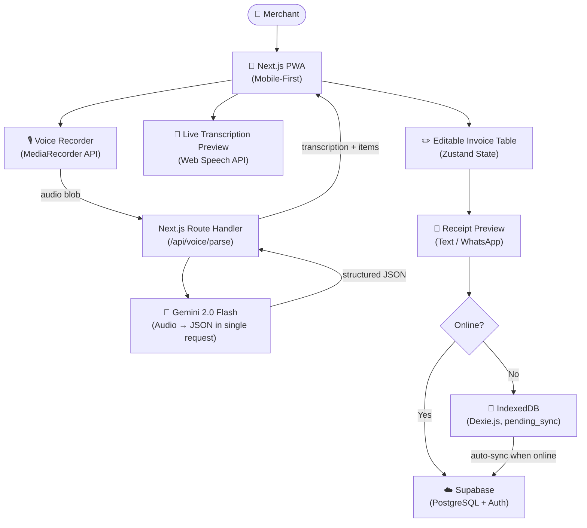
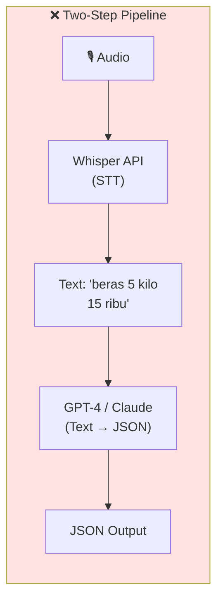
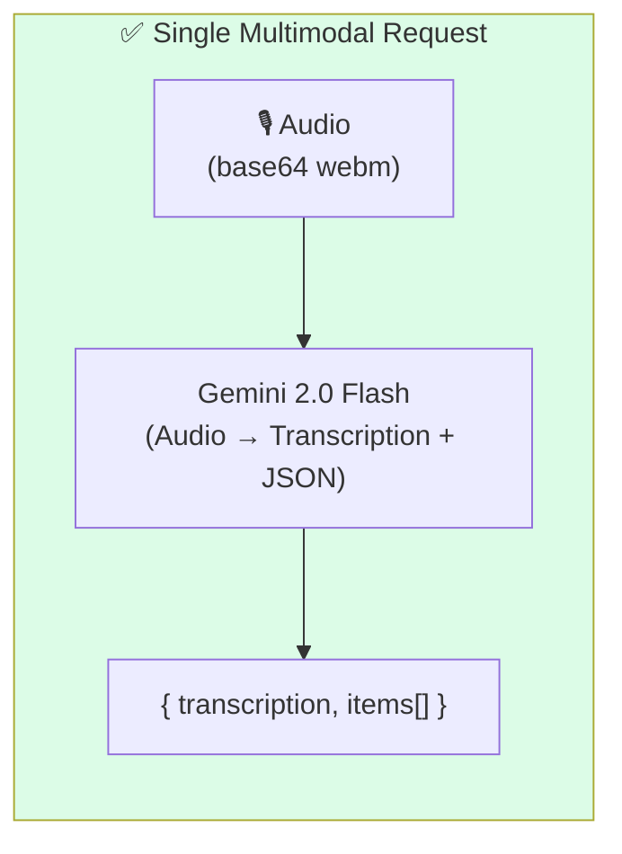
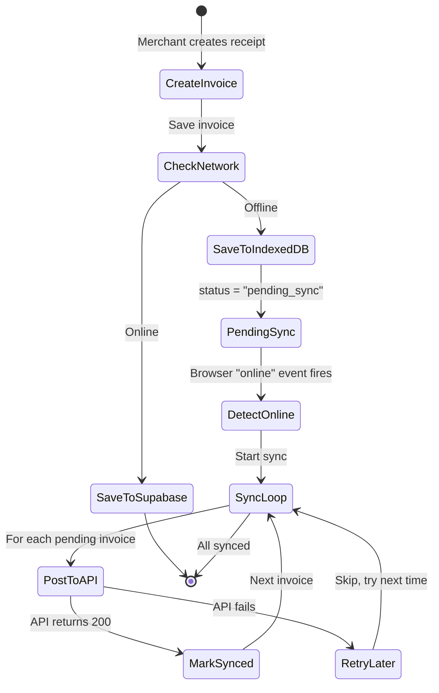
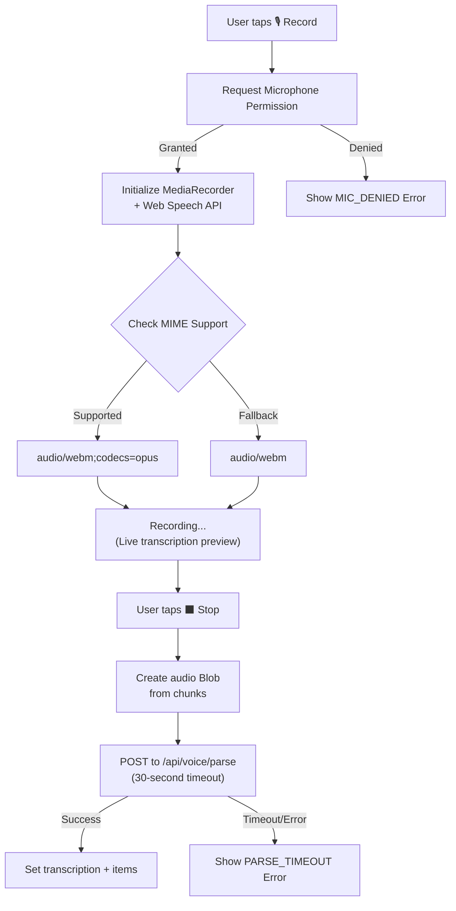
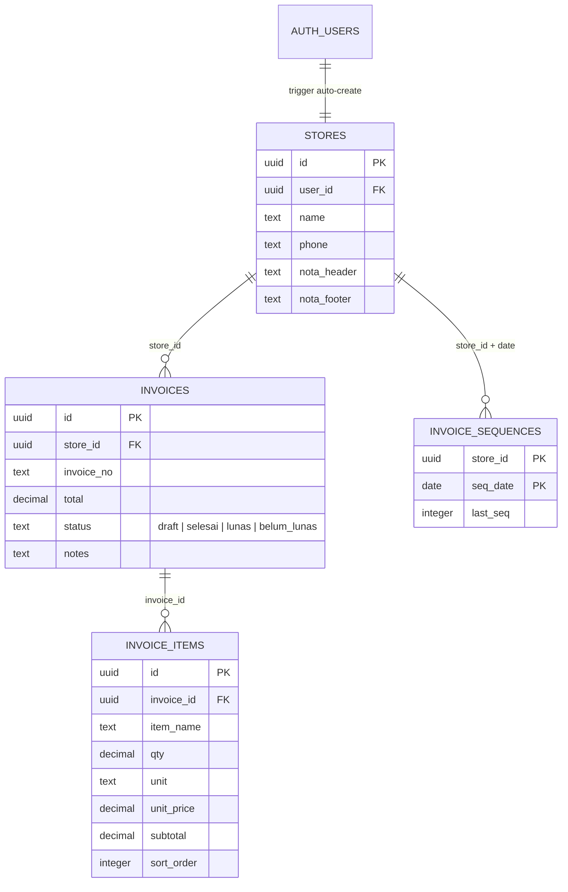

## Project Summary & Role

**VoiceInvoice** is an offline-first Progressive Web App (PWA) that allows traditional market merchants and small business owners to create digital receipts entirely by voice. Instead of writing receipts by hand or typing on tiny phone screens, merchants simply speak their items and prices, and the system uses Gemini 2.0 Flash multimodal AI to generate structured invoices in seconds.

**My Role:** Solo Developer (*End-to-end development*). Designed the product concept, built the multimodal AI voice-to-receipt pipeline, implemented the offline-first synchronization system with IndexedDB, and developed the full-stack application.

---

## Why I Built This

This project started from observation, not from a technical idea.

I noticed how traditional market merchants and small warung owners handle transactions during busy hours. They serve multiple customers simultaneously while trying to write receipts by hand. The process is slow, error-prone, and often leads to calculation mistakes-especially when a customer buys ten different items with varying quantities and prices.

Some merchants use basic calculator apps, but that still requires manual typing on small phone screens. Most don't use any digital system at all because existing POS applications are too complex, too expensive, or require stable internet they don't have.

I wanted to explore whether AI could genuinely simplify this workflow by allowing merchants to create receipts using only their voice-even in environments with poor or unreliable internet connections.

The key constraint was clear from the start:

> This system had to work reliably in a traditional market environment-with noisy surroundings, inconsistent internet, and users who may not be tech-savvy.

---

## System Architecture

The architecture is deliberately simple. Every design decision optimized for speed, reliability, and offline capability.



---

## The Key Architecture Decision: One Model vs. Two-Step Pipeline

This was the most important technical decision in the entire project, and it fundamentally shaped the system's reliability.

### The Two-Step Approach (Rejected)

My initial design used a **cascade pipeline**: audio goes to Whisper for transcription, then the text goes to a separate LLM for JSON parsing.



Problems with this approach:

* **Two network requests** instead of one-double the latency on mobile networks.
* **Two points of failure**-if either service was down, the entire pipeline broke.
* **Accumulated errors**-if Whisper misheard "lima belas ribu" as "lima ribu", the LLM would faithfully parse the wrong number.
* **Higher cost**-paying for two separate API calls per transaction.

### The Multimodal Approach (Chosen)

After testing Gemini 2.0 Flash, I discovered it could accept raw audio directly and return both the transcription and structured JSON in a **single request**.



The result was dramatic:

* **~50% lower latency**-one API call instead of two.
* **Single point of truth**-the model hears the audio directly instead of relying on an intermediate transcription.
* **Simpler codebase**-the entire AI logic fits in a single 84-line route handler.

The trade-off was vendor lock-in to Google's Gemini API. For the scale of this project, that was an acceptable compromise.

### The Prompt Engineering Challenge

Getting consistent JSON output from voice audio required careful prompt design. The system instruction includes:

* **Price normalization rules:** "lima belas ribu" → 15000, "15rb" → 15000
* **Smart defaults:** If quantity isn't mentioned, default to 1. If unit isn't mentioned, default to "pcs".
* **Valid unit whitelist:** pcs, kg, gram, liter, ml, bungkus, buah, lusin, porsi, mangkok, gelas, botol
* **Subtotal computation:** `subtotal = qty × unit_price`

A critical discovery: setting `responseMimeType: 'application/json'` in the Gemini config dramatically improved JSON output consistency. Without it, the model would occasionally wrap JSON in markdown code blocks or add explanatory text, breaking the parser.

---

## Offline-First: Not a Feature, a Requirement

For traditional market merchants, internet connectivity is not guaranteed. Markets are often in areas with poor signal, and merchants can't afford to lose a transaction because the server is unreachable.

I implemented offline support using **Dexie.js** (a wrapper around IndexedDB) with an automatic synchronization system.



### How the Sync Works

The `useOfflineSync` hook listens to browser `online`/`offline` events:

1. **When offline:** Invoices are saved to IndexedDB with `sync_status: 'pending_sync'`.
2. **When the browser comes back online:** The hook automatically fetches all pending invoices and POSTs them to `/api/invoices` one by one.
3. **On success:** The invoice is marked as `'synced'` in IndexedDB.
4. **On failure:** The invoice stays as `'pending_sync'` and will be retried next time.

A `isSyncingRef` guard prevents duplicate sync operations if the browser fires multiple `online` events in quick succession.

---

## The Voice Recording Pipeline

Recording audio on mobile web browsers is surprisingly inconsistent. I built the `useVoiceRecorder` hook to handle these cross-browser edge cases.



### The MIME Type Problem

Chrome Android supports `audio/webm;codecs=opus`, but Safari iOS does not. The recorder implements a runtime fallback:

```
MediaRecorder.isTypeSupported('audio/webm;codecs=opus')
  ? 'audio/webm;codecs=opus'
  : 'audio/webm'
```

This difference is invisible to users but was only discovered during testing on physical devices-the iOS simulator gave completely different results.

### Dual Recording Strategy

The hook simultaneously runs two systems:

1. **MediaRecorder API:** Captures actual audio bytes for sending to Gemini.
2. **Web Speech API:** Provides a real-time transcription preview so the user can see what's being captured while they speak. This preview is not used for the final parsing-it's purely a UX affordance to build user confidence.

If Web Speech API is not available (some browsers don't support it), the recording continues without the live preview. No functionality is lost.

---

## Database Design: Multi-Tenant Invoice System

The PostgreSQL schema supports a full multi-tenant store system with auto-generated invoice numbering.



### Key Design Decisions

**Auto-Store Creation:** A PostgreSQL trigger (`create_store_for_new_user()`) automatically creates a store record when a new user signs up. This means merchants can start creating receipts immediately after registration-zero configuration required.

**Invoice Sequence Numbers:** Instead of relying on UUIDs for invoice display (which would look meaningless to merchants), I built a `get_next_invoice_seq()` function that generates human-readable, date-based sequential numbers per store. The function uses `ON CONFLICT DO UPDATE` for atomic counter increment without race conditions.

**Nested RLS Policies:** Invoice items inherit their access control from invoices, which inherit from stores. Every RLS policy uses a subquery chain: `invoice_items → invoices → stores → user_id = auth.uid()`. This ensures complete data isolation between merchants.

---

## Receipt Output: Copy & WhatsApp

The `NotaPreview` component generates a formatted text receipt that can be copied to clipboard or shared directly via WhatsApp-the primary communication tool for Indonesian merchants.

```
========================
TOKO SAYA
NOTA PENJUALAN
========================
1. Beras
   5 kg x Rp 15.000
   Subtotal: Rp 75.000
2. Es Teh Manis
   1 pcs x Rp 3.000
   Subtotal: Rp 3.000
------------------------
TOTAL: Rp 78.000
========================
Terima kasih telah berbelanja!
```

The WhatsApp integration uses `wa.me/?text=` deep links, allowing merchants to send receipts directly to customers without any additional setup.

---

## Authentication & Security

The Next.js middleware implements Supabase Auth with intelligent routing:

* **Protected routes:** All dashboard, invoice, and settings pages require authentication.
* **Public routes:** Only `/login` is publicly accessible.
* **Post-login redirect:** The middleware saves the original URL in a `?next=` parameter, so users land on their intended page after login.
* **PWA static file bypass:** `manifest.json`, `sw.js`, and icon files skip authentication entirely to prevent PWA installation issues.
* **getUser() over getSession():** The middleware uses `supabase.auth.getUser()` which makes a network call to validate the token, rather than `getSession()` which only reads the local cookie-significantly more secure against token tampering.

---

## Key Technical Decisions

| Decision | Choice | Reason |
|----------|--------|--------|
| **AI Model** | Gemini 2.0 Flash (multimodal) | Single request: audio → transcription + JSON. ~50% faster than two-step pipeline |
| **Offline Storage** | Dexie.js (IndexedDB) | Reliable client-side persistence with automatic sync |
| **State Management** | Zustand | Lightweight, simple API for managing recording state, items, and offline status |
| **MIME Handling** | Runtime fallback | `audio/webm;codecs=opus` → `audio/webm` for Safari compatibility |
| **JSON Consistency** | `responseMimeType: 'application/json'` | Forces Gemini to output clean JSON without markdown wrapping |
| **Invoice Numbers** | `get_next_invoice_seq()` | Atomic, date-based sequential numbering per store |

---

## What I Learned

**Simpler Architectures Win** - My initial two-step pipeline (Whisper → LLM) was more "impressive" on paper but slower, more expensive, and less reliable. Replacing it with a single multimodal request was the best engineering decision I made. Sometimes the most elegant solution is the one with fewer moving parts.

**Offline Is a Feature, Not an Afterthought** - For traditional market merchants, offline reliability is more valuable than advanced functionality. The `useOfflineSync` hook with `pending_sync` status tracking was essential, not optional. Building for users with unreliable internet fundamentally changed how I think about web application architecture.

**Browser APIs Are Inconsistent** - The MIME type difference between Chrome Android and Safari iOS was invisible in development. It only surfaced during physical device testing. This taught me that mobile web features must be tested on real hardware, not simulators.

**Good Technology Adapts to Users** - The biggest lesson from VoiceInvoice isn't technical. It's that great products succeed when they fit naturally into users' daily workflows. A merchant doesn't care about multimodal AI or IndexedDB. They care that they can say *"beras 5 kilo tujuh puluh ribu"* and get a receipt they can WhatsApp to their customer in 10 seconds.

> This project changed my perspective on what "good engineering" means. It's not about adding more models and features-it's about solving real problems with the simplest architecture that works reliably in the user's actual environment.

---

**Read the full story behind this project** → [Blog Post](/blog/voiceinvoice).

---

## Source Code

The complete source code for this project is available at:

[GitHub Repository](https://github.com/Fauza27/VoiceInvoice)

The repository includes the full Next.js application, Supabase migration scripts, and documentation covering the architecture decisions and deployment configuration.
